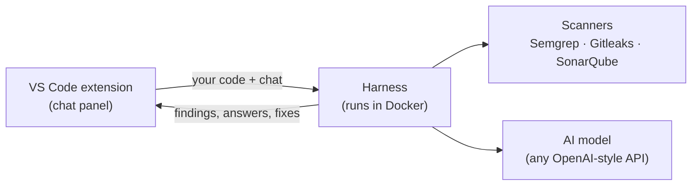

# vscode-code-scanner

A security scanner you run on your own machine and use from a chat panel in VS Code.

You type what you want, like "scan this project" or "fix all high findings". The scanner finds security problems in your code, an AI checks each one and explains it in plain words, and a coding agent can fix them for you. You see every fix as a diff before anything changes.

## How it works



There are two parts:

| Part | What it does |
| --- | --- |
| [**Harness**](analyzer-agent-harness/) | A server in Docker. It gets your code, runs the scanners, asks the AI to review each finding, answers chat, and runs the fix agent. |
| [**VS Code extension**](vscode-extension/) | The chat panel. It sends your code to the harness, shows findings in the editor, and applies fixes you accept. |

The three scanners each look for different things:

- **Semgrep:** unsafe code patterns, such as SQL injection, command injection, XSS and weak crypto. It has 1171 rules for Python, Java, Kotlin, C#, JavaScript, TypeScript, React, Go, PHP, Ruby, Terraform, Dockerfiles and Kubernetes.
- **Gitleaks:** passwords, keys and tokens written in the code. The harness never sees the secret itself.
- **SonarQube:** bugs and security hotspots.

## What you can do

- **Scan by chat.** "scan this project", "scan the src folder", "scan https://github.com/owner/repo". Private GitHub repos work after you sign in to GitHub in VS Code.
- **See results live.** Findings show up as each scanner finishes. The AI then marks each one as likely real or a likely false alarm, explains it, and says how to fix it. False alarms are hidden until you ask to see them.
- **Get a summary.** After every scan you get a short card: counts, the files with the most problems, and the top three things to fix first.
- **Fix with an agent.** Click **Fix** or **Fix all**, or type "fix all high findings". The agent reads the code, edits it, runs the scanners again to check its work, and reports what it fixed. Nothing is saved until you click **Apply**.
- **Rescan fast.** After you save a file that had findings, the **Rescan** button lights up. A rescan only uploads and scans the files that changed.
- **Ask questions.** "why is this a problem?", "how do I fix finding abc123?". The AI can read your code and search the web for advice.

## Setup, step by step

The whole setup takes about 15 minutes, mostly waiting for Docker.

### Step 1. Install what you need

- [Docker](https://docs.docker.com/get-docker/) with Compose v2
- [Node.js](https://nodejs.org/) 20 or newer, with npm
- [VS Code](https://code.visualstudio.com/), with the `code` command on your PATH (in VS Code: *Command Palette → Shell Command: Install 'code' command in PATH*)
- Python 3.8 or newer (used by the setup script)
- **Windows only:** [Git for Windows](https://git-scm.com/download/win), which gives you **Git Bash**. Run every command below in Git Bash, not in PowerShell or cmd.
- An AI model with an OpenAI-style API. This can run on your own machine (LM Studio, Ollama, vLLM) or in the cloud.

### Step 2. Get the code

```sh
git clone https://github.com/DansPK/vscode-code-scanner.git
cd vscode-code-scanner
```

On Windows, open **Git Bash** (Start menu) for this and every later step.

### Step 3. Create the settings file

```sh
./setup.sh
```

The first run creates `analyzer-agent-harness/.env` and stops.

### Step 4. Fill in your AI model

Open `analyzer-agent-harness/.env` and fill in these three lines. Leave the rest as it is.

```sh
LLM_BASE_URL=http://host.docker.internal:11434/v1   # your model server's /v1 address
LLM_API_KEY=your-key                                # any text if your server needs no key
LLM_MODEL=openai/your-model-name                    # "openai/" + the model's id
```

- **`LLM_BASE_URL`:** the harness runs inside Docker, so `localhost` means the container, not your computer. For a model on your own computer, use `host.docker.internal` (works on Windows, macOS and Linux) or your computer's network IP.
- **`LLM_MODEL`:** always starts with `openai/`. To see your server's model ids, run `curl <LLM_BASE_URL>/models`.

### Step 5. Run the setup

```sh
./setup.sh
```

This run does the rest for you:

1. Makes the secret keys.
2. Picks free ports, if 8080 or 9000 are taken.
3. Starts SonarQube and makes its token.
4. Builds and starts the harness.
5. Checks that the AI model answers.
6. Makes your user token.
7. Builds and installs the VS Code extension, and sets its server address.

On Linux it may ask for `sudo` once, because SonarQube needs a system setting (`vm.max_map_count`). On Windows and macOS, Docker Desktop already has it.

Your user token goes straight into VS Code's settings. The extension moves it to VS Code's secure storage and clears it from the settings. If the script can't edit your VS Code settings, it prints the token once instead; copy it for Step 6.

### Step 6. Connect VS Code

1. Run **Developer: Reload Window** in VS Code (Command Palette).
2. Only if Step 5 printed a token: run **Vuln Scanner: Set Token** and paste it.

If `setup.sh` could not install the extension (for example, `code` is not on your PATH), follow [Install the VS Code extension by hand](#install-the-vs-code-extension-by-hand).

### Step 7. Scan

1. Open a project folder in VS Code.
2. Click the **shield icon** in the left bar to open the Vuln Scanner panel.
3. Type `scan this project`.

Findings show up in the panel and as squiggles in your code. Click a finding to jump to its line.

### Running it again later

The harness keeps running in Docker. After a restart of your computer, start it with:

```sh
cd analyzer-agent-harness
docker compose up -d
```

`./setup.sh` is safe to run again at any time. It keeps your tokens. More options:

| Option | What it does |
| --- | --- |
| `HARNESS_USER=alice ./setup.sh` | Makes the token for user `alice` (default: your login name). |
| `NEW_TOKEN=1 ./setup.sh` | Makes a new token and replaces your old one. |
| `SONAR_ADMIN_PASSWORD=... ./setup.sh` | Use this if you changed SonarQube's admin password. |

To set things up by hand instead, or for HTTPS, see [docs/SETUP.md](docs/SETUP.md).

### After setup: two safety steps

- **Change SonarQube's password.** SonarQube starts with the login `admin` / `admin`. Open it (the setup prints its address), log in, and change the password. The token keeps working.
- **Keep `.env` private.** It holds your keys. Git already ignores it; never share it.

## Install the VS Code extension by hand

`setup.sh` does all of this for you. Use these steps if it couldn't, if you set up the harness by hand, or if you want to connect another computer to a harness that is already running.

### 1. Build the extension file

You need Node.js 20 or newer.

```sh
cd vscode-extension
npm ci
npm run build
npx @vscode/vsce package --allow-missing-repository --skip-license -o vuln-scanner.vsix
```

This makes `vscode-extension/vuln-scanner.vsix`. You can copy this file to other computers; they don't need to build it.

### 2. Install it in VS Code

Pick one:

- **From the command line:**
  ```sh
  code --install-extension vuln-scanner.vsix --force
  ```
- **From VS Code:**
  1. Open the **Extensions** view (`Ctrl+Shift+X`, or `Cmd+Shift+X` on macOS).
  2. Click the **…** menu at the top of the view.
  3. Choose **Install from VSIX…** and pick `vuln-scanner.vsix`.

You now have a **shield icon** in the left bar. The extension needs VS Code 1.90 or newer.

### 3. Get a user token

Every person needs their own token. On the computer that runs the harness:

```sh
cd analyzer-agent-harness
docker compose exec harness harness-token alice --name "Alice"
```

The token is printed **once**. Copy it now. If you lose it, run the command again to make a new one (the old one stops working).

### 4. Set the server address

1. Open **Settings** (`Ctrl+,`, or `Cmd+,` on macOS).
2. Search for `vulnScanner`.
3. Set **Vuln Scanner: Server Url** to the harness address, for example `http://localhost:8080`.

Use the same address as `HARNESS_PUBLIC_URL` in `analyzer-agent-harness/.env`. `setup.sh` may have picked another port, such as `8090`; it prints the address at the end. From another computer, use the harness computer's IP, for example `http://192.168.1.20:8080`, and set `HARNESS_PUBLIC_URL` to that same address.

Or add it to your `settings.json` directly:

```json
{
  "vulnScanner.serverUrl": "http://localhost:8080"
}
```

### 5. Add your token

1. Open the Command Palette (`Ctrl+Shift+P`, or `Cmd+Shift+P` on macOS).
2. Run **Vuln Scanner: Set Token**.
3. Paste the token from step 3 and press Enter.

The token is kept in VS Code's secure storage, not in your settings. You can also paste it into the **Vuln Scanner: Token** setting; the extension moves it to secure storage and clears the setting right away.

### 6. Reload and check the connection

1. Run **Developer: Reload Window** from the Command Palette.
2. Click the **shield icon** to open the **Vuln Scanner** panel.
3. The panel should show your session and an empty chat. If it shows an error instead, see [If something goes wrong](#if-something-goes-wrong).

### 7. Run your first scan

1. Open your project folder in VS Code (**File → Open Folder**).
2. In the Vuln Scanner panel, type `scan this project` and press Enter.
3. Watch the progress bar. Findings appear as each scanner finishes, then the AI reviews them one by one.
4. When the scan is done, a **summary card** shows the counts and what to fix first.

### 8. Use it

| To do this | Do this |
| --- | --- |
| See a finding's details | Open the **Findings** tab and expand a finding: what's wrong, why it matters, how to fix it. |
| Go to the code | Click **Open** on a finding, or click it in the **Problems** panel. Findings also show as squiggles in your code. |
| Fix one finding | Click **Fix**. Check the diff, then click **Apply fix** or **Skip**. |
| Fix many | Click **Fix all**, or type "fix all high findings". Then choose **Apply all**, or **Review one by one** to see each diff. |
| Scan again after editing | Save your files, then click **Rescan** (it lights up when files with findings changed). |
| Scan one folder | Type "scan only src/auth". |
| Scan a GitHub repo | Type "scan https://github.com/owner/repo". For a private repo, click **Sign in to GitHub** when asked. |
| Ask a question | Type it, for example "why is finding abc123 a problem?". |
| Stop a scan | Click **Stop**, or type "stop". |
| Show hidden false alarms | Click **Show them** on the Findings tab, or turn on **Vuln Scanner: Show Likely False Positives** in Settings. |
| Switch or manage sessions | Use the picker at the top of the panel: **New**, **Rename**, **Delete**. |

### Optional settings

| Setting | What it does |
| --- | --- |
| `vulnScanner.caCertificate` | Full path to a certificate file, for a harness with HTTPS and a self-signed certificate (see [docs/SETUP.md](docs/SETUP.md#optional-https)). |
| `vulnScanner.extraExcludes` | More files or folders to skip, in `.gitignore` style, for example `["data/", "*.min.js"]`. |
| `vulnScanner.maxFileSizeKB` | Skip files bigger than this (default 2048). |
| `vulnScanner.maxUploadMB` | Stop before uploading more than this (default 200). |
| `vulnScanner.showLikelyFalsePositives` | Show findings the AI thinks are false alarms (default off). |

Folders like `.git`, `node_modules`, `dist`, `build` and `.venv`, and everything in your `.gitignore`, are never uploaded.

### Update or remove the extension

- **Update:** pull the latest code, build the `.vsix` again (step 1), install it again (step 2), and reload the window.
- **Remove:** in the Extensions view, find **Vuln Scanner** and click **Uninstall**. To also forget your token, run **Vuln Scanner: Clear Token** first.

## If something goes wrong

| Problem | What to do |
| --- | --- |
| "The LLM cannot be reached" | The harness can't reach your model. Check `LLM_BASE_URL` (Step 4), then run `docker compose up -d harness` in `analyzer-agent-harness/`. |
| "No token is set" | Run **Vuln Scanner: Set Token** again. |
| "Token rejected" | The token is wrong or was replaced. Make a new one ([step 3](#3-get-a-user-token)) and set it again. |
| No shield icon | The extension isn't installed or VS Code is older than 1.90. Install it again and reload the window. |
| Logs | **View → Output**, then pick **Vuln Scanner** in the list. Logs never show your token or your code. |
| "The scanner server cannot be reached" | The harness isn't running. Run `docker compose up -d` in `analyzer-agent-harness/`. |
| Scans or fixes are slow | Small local models are slow, and fixing many findings takes a while. Fix a few at a time, or use a faster model. |
| SonarQube error after a scan | SonarQube may still be starting. Wait a minute and scan again. The other scanners' findings are kept. |

To see what the harness is doing:

```sh
cd analyzer-agent-harness
docker compose logs -f harness
```

More help is in [docs/SETUP.md](docs/SETUP.md#troubleshooting).

## Project layout

```
vscode-code-scanner/
├── setup.sh                  one-command setup
├── analyzer-agent-harness/   the server (Python, Docker)
├── vscode-extension/         the VS Code extension (TypeScript)
└── docs/
    ├── SETUP.md                       setup by hand, HTTPS, troubleshooting
    ├── PROJECT_FLOW.md                how a request moves through the system
    ├── SOURCE_CODE_ANALYSIS_FLOW.md   how a scan turns code into findings
    ├── harness/                       the harness plan and design choices
    └── extension/                     the extension plan and design choices
```

## For developers

Harness (needs [uv](https://docs.astral.sh/uv/)):

```sh
cd analyzer-agent-harness
uv sync
uv run pytest
```

Extension:

```sh
cd vscode-extension
npm ci
npm run build
npm run test:unit
npm run test:integration   # opens a VS Code window for a short time
```

The plans in [docs/harness/](docs/harness/) and [docs/extension/](docs/extension/) are the source of truth. Both share one "Shared contract" section, which must stay the same in both files.

## Your code and data

- Your code goes only to the harness you run, and to the AI model you choose. If you use a cloud model, the code around each finding is sent to that service.
- Secrets found in the code are hidden as `****` before the AI sees anything.
- Tokens and keys are never written to logs.
