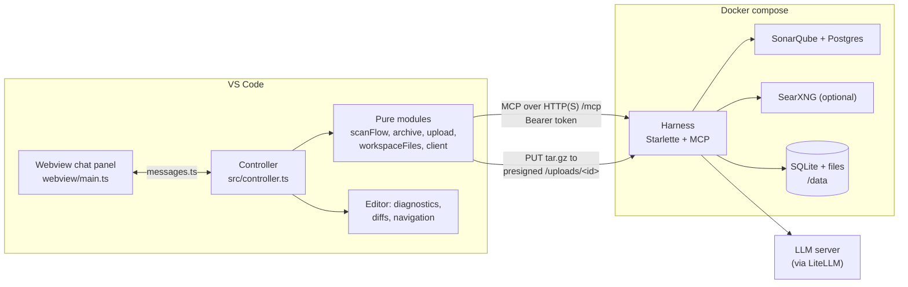
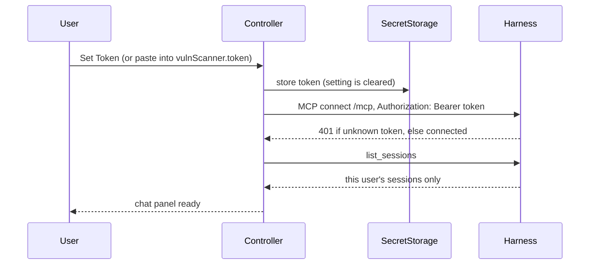
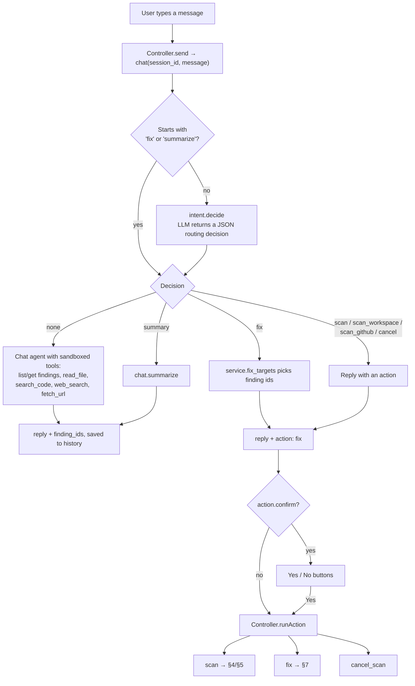
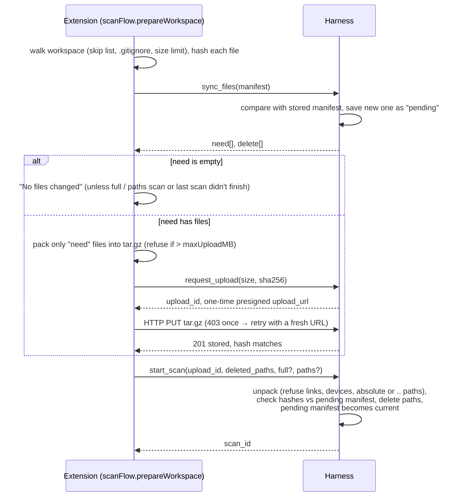
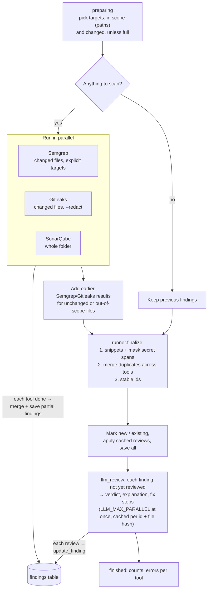
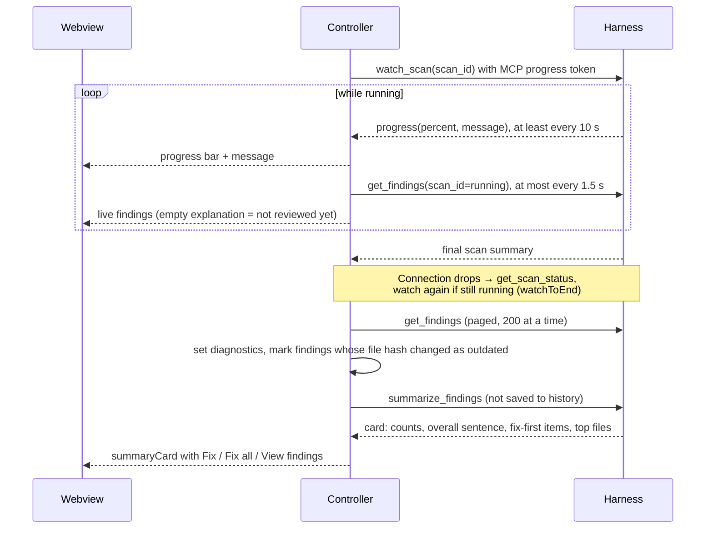
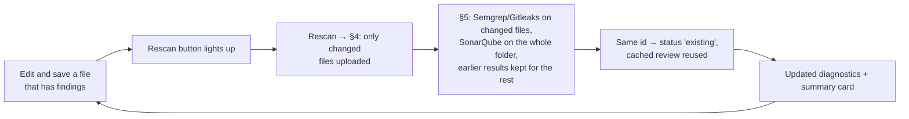

# Project flow

How a request travels through vscode-code-scanner: from typing in the chat panel, through the harness and its scanners, to findings in the editor and fixes applied to files.

For setup see [SETUP.md](SETUP.md). For the exact API see the "Shared contract" section in either plan file ([harness](harness/IMPLEMENT_HARNESS.md), [extension](extension/IMPLEMENT_VSCODE_EXTENSION.md)).

## 1. The pieces



| Piece | Role |
| --- | --- |
| Webview ([main.ts](../vscode-extension/webview/main.ts)) | Draws the chat, progress, findings, summary card and fix transcript. Talks only to the controller. |
| Controller ([controller.ts](../vscode-extension/src/controller.ts)) | The only VS Code glue: token, sessions, scans, diagnostics, diffs, applying fixes. |
| Pure modules (`src/*.ts`) | Walk and hash files, pack the tar.gz, upload, call MCP tools. Unit-tested without VS Code. |
| Harness ([app.py](../analyzer-agent-harness/src/harness/app.py)) | Thin MCP tool wrappers. Each one reads the user from the token and calls `Service`. |
| Service ([service.py](../analyzer-agent-harness/src/harness/service.py)) | Sessions, file sync, uploads, chat routing, summary, fix requests. |
| ScanManager ([scans.py](../analyzer-agent-harness/src/harness/scans.py)) | Runs scans as background asyncio tasks and publishes progress and partial findings. |
| Scanners (`harness/scanners/`) | Semgrep, Gitleaks and SonarScanner run in parallel; results are merged. |
| LLM ([llm.py](../analyzer-agent-harness/src/harness/llm.py)) | Reviews findings, routes chat, answers questions, runs the fix agent. |

## 2. Connecting



- Tokens are made on the server with `harness-token <user>`; each one maps to one user.
- `connect()` finishes the connection first, then loads sessions through `ready()`.
- With `vulnScanner.caCertificate` set, both MCP and uploads trust that CA ([http.ts](../vscode-extension/src/http.ts)).

## 3. Chat decides what happens

Every message goes to the `chat` tool. The harness decides what it means.



- Only the extension can upload files or change the workspace, so scans and fixes come back as actions that the extension carries out.
- If `chat` fails with an LLM error, `keywordAction` ([routing.ts](../vscode-extension/src/routing.ts)) recognises plain scan commands so scanning still works.
- The only scan button is **Rescan**. It lights up after you save a file that has findings.

## 4. Workspace scan: sync and upload

The first scan and every rescan use the same steps. Only changed files are uploaded.



**GitHub sessions** skip all of this: `start_scan` clones the repo the first time (symlinks removed) and pulls after that. Findings get a `web_url` to the line on GitHub.

## 5. Running a scan (harness side)

`ScanManager._run` runs in the background. Only one scan runs per session.



Key rules:

- **Stable ids** hash tool + rule + path + the trimmed start-line text, not the line number. Statuses, review caching and merging rely on this.
- **Secrets never leave masked.** Gitleaks runs with `--redact`, and the column spans the tools report are masked in snippets, LLM prompts and the chat's `read_file` / `search_code`.
- **A tool failing doesn't fail the scan.** Its error goes into the summary's `error`, and the other tools' results are kept.
- Each scan saves its raw per-tool findings to `raw/tool_findings.json`, which the next incremental scan reuses.

## 6. Watching progress and showing findings



Clicking a finding opens the file at its line. `chat.summarize` skips the LLM when nothing is likely real.

## 7. Fixing findings

Starts from a **Fix** / **Fix all** button or a chat message like "fix all high findings".

```mermaid
sequenceDiagram
  participant W as Webview
  participant C as Controller
  participant H as Harness (agent.py)
  participant L as LLM
  C->>H: fix_findings(session_id, finding_ids)
  par one agent per file with findings (LLM_MAX_PARALLEL)
    H->>L: task (small files included whole), streamed
    L-->>H: tool calls: read_file, search_code, edit_file,<br/>check_fixes, web_search, finish
    H->>H: edits go to a shared in-memory copy (masked view;<br/>edits writing back **** are refused)
    H->>H: check_fixes: Semgrep with only the targets' rules + Gitleaks
    H-->>C: progress JSON {file, kind, text}
    C-->>W: live transcript (thinking, text, tool, result)
  end
  H-->>C: files[] (whole-line edits + file_sha256), summary, results[] per finding
  C->>C: refuse a file that is dirty or whose hash ≠ file_sha256
  C-->>W: several files → Apply all / Review one by one
  C->>C: show vscode.diff against a virtual vulnscanner-fix: document
  W->>C: Apply fix
  C->>C: write and save the file
```

- Nothing changes on either side until you click **Apply fix**. The harness only works on its copy.
- Each finding comes back `fixed`, `still_reported`, `not_verified` (SonarQube can't recheck a single file) or `not_fixed`.
- If the model or server can't do tool calling, `fix.propose` makes one-shot edits per finding instead.
- Workspace sessions only, and not while a scan runs.

## 8. Rescan loop



## 9. Where things live on the server

```
/data
├── harness.db                      sessions, messages, scans, findings, review cache
├── uploads/                        archives waiting for start_scan
└── sessions/<session_id>/
    ├── code/                       current copy of the workspace or clone
    └── scans/<scan_id>/raw/
        └── tool_findings.json      unmerged per-tool findings, reused by the next scan
```

At startup the harness recovers scans that were interrupted, preloads the Semgrep rules for the fix agent, and starts a background loop that removes old uploads.
