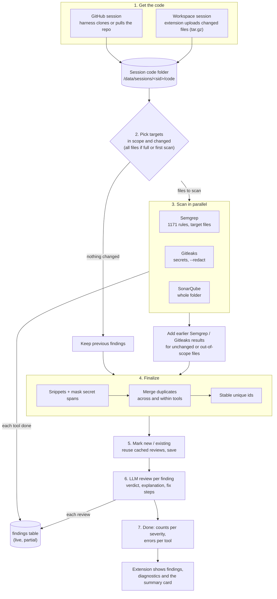
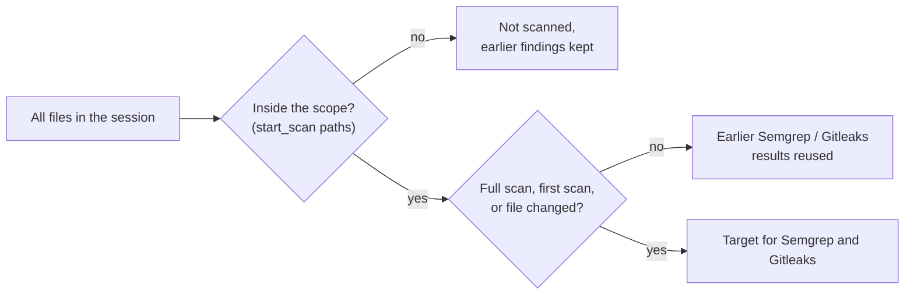
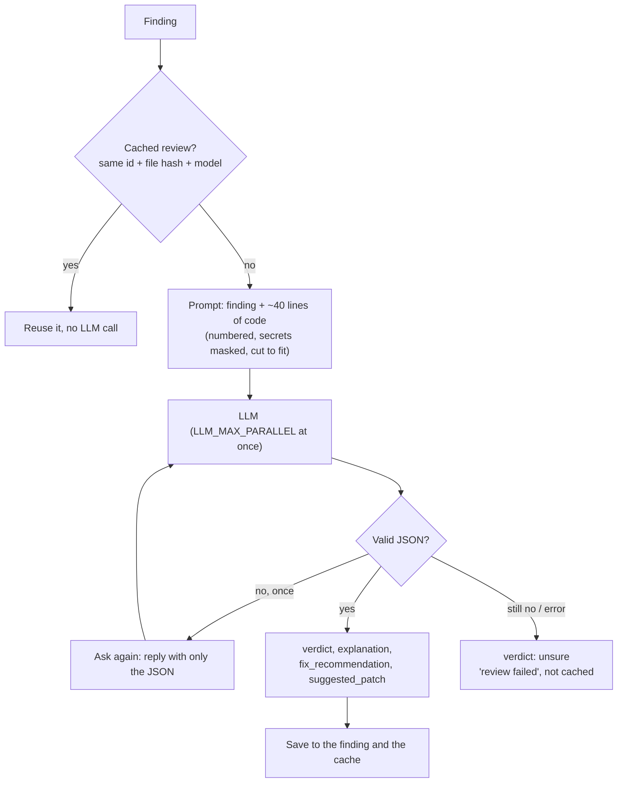

# Source code analysis flow

How the harness turns a folder of source code into a list of reviewed findings: where the code comes from, which files are scanned, how three scanners' results become one list, and how the LLM checks each finding.

For the whole request path (chat, sessions, fixes) see [PROJECT_FLOW.md](PROJECT_FLOW.md). For the exact finding fields see the "Shared contract" section in [IMPLEMENT_HARNESS.md](harness/IMPLEMENT_HARNESS.md).

## 1. Overview

The scan runs as a background task (`ScanManager._run` in [scans.py](../analyzer-agent-harness/src/harness/scans.py)). Only one scan runs per session, and it can be cancelled at any stage.

| Stage | Progress | Message shown |
| --- | --- | --- |
| preparing | 2 % | Preparing the scan |
| semgrep / gitleaks / sonarqube | 5–60 % | `Semgrep: 12 findings (20 so far)` as each tool finishes |
| merging | 60 % | Merging results |
| llm_review | 65–99 % | `LLM review: 4 of 18 new findings` |
| finished | 100 % | `Done: 31 findings` |

## 2. Getting the code

**Workspace session.** The extension walks the workspace, skipping ignored, binary and very large files, and hashes every file. It sends the list of hashes (the manifest) to the harness, which answers with the files it doesn't have yet. The extension packs only those files into a tar.gz and uploads it to a presigned URL, together with the list of deleted files.

Before anything reaches the code folder, unpacking refuses links, devices, absolute paths and `..`.

**GitHub session.** The harness makes a shallow clone on the first scan, then fetches and resets to the latest commit on later scans. A private repo uses the user's own GitHub token, passed to git through its environment only and never stored. Every symlink in the clone is removed, so scanners can't follow a link out of the repo.

## 3. Picking targets

- **Incremental by default.** A rescan only runs Semgrep and Gitleaks on files that changed since the last scan. Each scan saves its unmerged per-tool results to `raw/tool_findings.json`, so the next scan can reuse them for unchanged files.
- **SonarQube always scans the whole folder,** because Community Edition has no partial scan. With a scope, its inclusions are limited to the scoped folders.
- **Nothing changed** (and no full scan asked for): no tool runs, and the previous findings are kept.

## 4. The three scanners

They run at the same time. A tool that fails does not fail the scan: its error goes into the scan's `error`, and the other tools' findings are kept.

| Tool | What it finds | How it is run | Severity mapping |
| --- | --- | --- | --- |
| **Semgrep** | Code patterns: injection, unsafe APIs, weak crypto, XSS and more, across languages | 29 rule packs merged into one file (1171 rules, duplicates removed). Always given **explicit file targets**, so its default ignore list can't skip folders like `tests/`. Batched to keep the command line short. Metrics and version checks are off. | `CRITICAL`→critical, `ERROR`/`HIGH`→high, `WARNING`/`MEDIUM`→medium, `INFO`/`LOW`→low |
| **Gitleaks** | Hard-coded secrets: keys, tokens, passwords | `gitleaks dir . --redact`, so the harness **never sees secret values**. Results are limited to the target files. | Always high, CWE-798 |
| **SonarQube** | Bugs, vulnerabilities and security hotspots, with deeper analysis for some languages | `sonar-scanner` uploads the folder to the SonarQube server, the harness waits for the server's analysis task, then reads issues and hotspots through the API. The CWE comes from the rule's facets. | `BLOCKER`→critical, `CRITICAL`→high, `MAJOR`→medium, `MINOR`→low, `INFO`→info (newer impact severities map by name) |

Two extra filters cut known noise:

- Semgrep rules marked `harness-sql-text` only count when the matched code actually looks like SQL, so a template string such as ``className={`...${x}`}`` isn't reported as SQL injection.
- The SonarScanner CLI can't analyse C#, and JS/TS analysis needs Node.js 24 in the image.

**Live findings.** As each tool finishes, the harness merges what it has so far and saves it, so the extension shows findings before the scan is done.

## 5. Finalizing: one clean list

`runner.finalize` ([runner.py](../analyzer-agent-harness/src/harness/scanners/runner.py)) runs three steps in this order:

1. **Snippets and masking.** Each finding gets a few lines of code around it. Any column span a tool reported as a secret is replaced by `****` in snippets, in LLM prompts and in the chat's `read_file` / `search_code`. This happens before merging, so every tool's secret location is masked.
2. **Merging** ([merge.py](../analyzer-agent-harness/src/harness/scanners/merge.py)). One finding is kept per problem:
   - **Across tools:** same file, overlapping lines, and the same CWE (or, with no CWE, titles at least 60 % similar).
   - **Within one tool:** several rules on the same start line with the same CWE, for example three Semgrep command-injection rules.
   - The kept finding lists every tool that reported it and takes the **highest severity**.
3. **Stable ids.** An id is a hash of tool + rule + path + the trimmed text of the start line, **never the line number**. Adding lines above a finding doesn't change its id, so statuses, the review cache and new/existing marking keep working. Two identical lines with the same rule get an occurrence number, in line order.

Then each finding is marked **new** (not in the previous scan) or **existing**.

## 6. LLM review

- **Verdicts:** `likely_real`, `likely_false_positive` or `unsure`. The extension hides likely false alarms by default, with a **Show them** button.
- **Written for non-experts:** a plain explanation of the problem (or why it is a false alarm) and plain fix steps.
- **Before a review arrives,** a finding's `explanation` is empty and its verdict is `unsure`.
- **Small models** often return near-JSON; `parse_review` accepts it.
- **When the LLM can't be reached,** the remaining reviews are skipped at once instead of each waiting for a timeout. The scan still finishes with every scanner's findings, and `llm` appears in its errors.
- **Only real reviews are cached,** so a failed one is retried on the next scan. Changing the model reviews everything again.

## 7. Result

When the scan finishes, the harness stores:

- the findings, each with severity, tools, CWE, path and lines, masked snippet, status, verdict and the review text;
- the counts per severity;
- the errors per tool, for example `sonarqube: not run` or `llm: The LLM cannot be reached`.

The extension then loads the findings, sets editor diagnostics, marks findings whose file changed since as outdated, and asks for the **summary card** (`summarize_findings`): counts, one overall sentence, up to three fix-first items and the most affected files. From there the user can open a finding, ask about it in chat, or run the fix agent ([PROJECT_FLOW.md §7](PROJECT_FLOW.md#7-fixing-findings)).

## 8. Rules that hold throughout

- **No secret values anywhere.** Gitleaks redacts, secret spans are masked before any snippet, prompt or chat tool sees the code, and logs never contain tokens, signatures or keys.
- **Paths are relative,** use forward slashes, and have no `..` or empty parts.
- **One failing piece never loses the rest:** a scanner failing, a review failing or the LLM being down each still give a finished scan with everything else.
